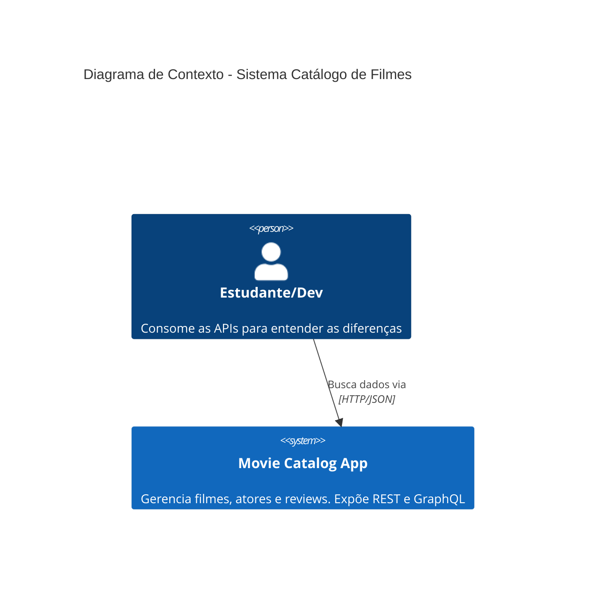
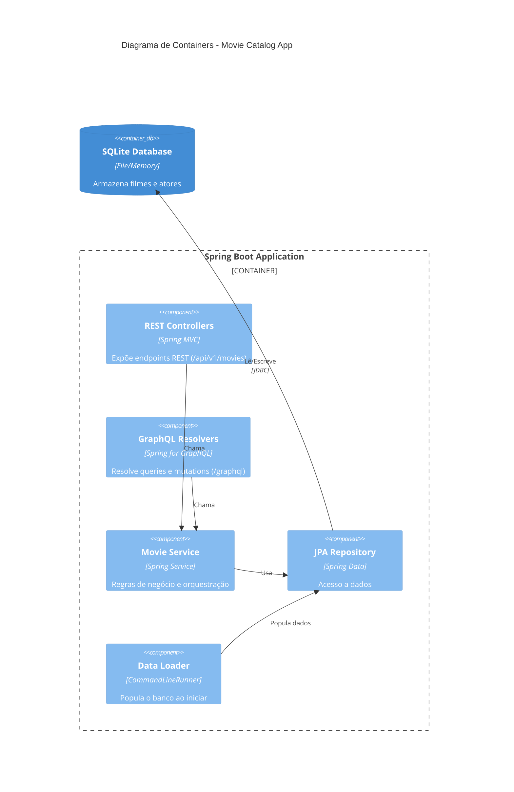

# Arquitetura de Componentes - PoC REST vs GraphQL

## Contexto (C4 Nível 1)
O sistema é uma aplicação monolítica simples (`MovieCatalogApp`) que expõe duas interfaces de comunicação distintas (REST e GraphQL) para consumo por clientes HTTP (Console/Insomnia).

## Containers (C4 Nível 2)
A aplicação é construída sobre o Spring Boot, com separação lógica entre os controladores REST e os Resolvers GraphQL, ambos acessando a mesma camada de serviço e dados.

## Decisões Arquiteturais
1.  **Separação de Interfaces**: As camadas de entrada (`controller` vs `resource/resolver`) estarão em pacotes distintos (`api.rest` e `api.graphql`) para evidenciar a diferença de tratamento da requisição.
2.  **Schema First**: O contrato GraphQL será definido explicitamente em `src/main/resources/graphql/schema.graphqls`.
3.  **Logging**: Um `OncePerRequestFilter` será configurado para interceptar e logar todas as requisições, fundamental para a demonstração de "N requests no REST".
