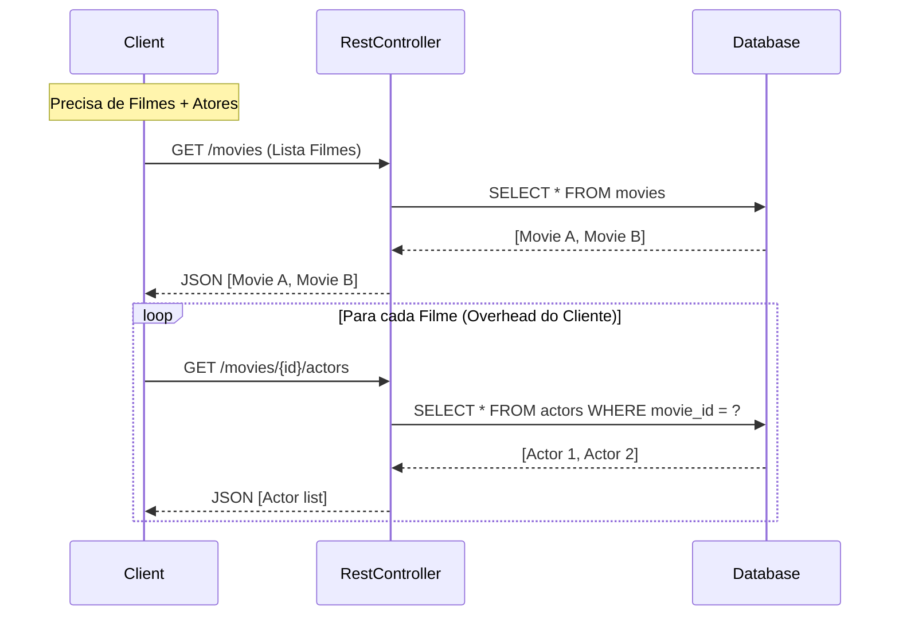
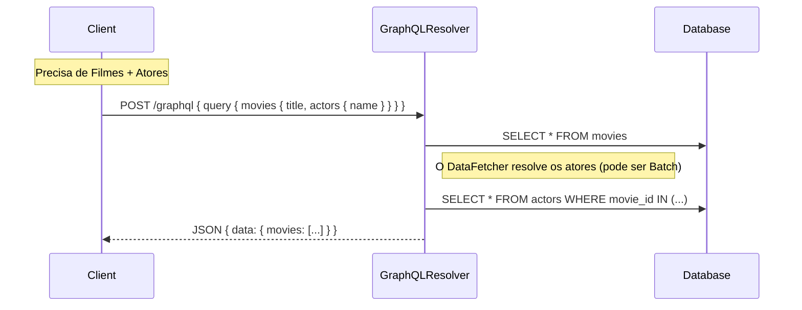

# Fluxos e Casos de Uso - PoC REST vs GraphQL

## Fluxo 1: Leitura de Catálogo (Comparativo)

Este fluxo demonstra a principal diferença de "round-trips" entre as tecnologias.

### Cenário REST (Múltiplas Chamadas)
O cliente precisa exibir o título do filme e nomes dos atores.



### Cenário GraphQL (Single Request)
O cliente pede exatamente o que precisa em uma chamada.



## Fluxo 2: Criação de Conteúdo

Demonstra que para operações de escrita, a complexidade é similar.

```mermaid
flowchart LR
    subgraph REST
    R_Input[JSON Body] --> R_POST[POST /movies]
    R_POST --> R_Save[Service.save()]
    end

    subgraph GraphQL
    G_Input[Mutation Input] --> G_Mut[mutation createMovie]
    G_Mut --> G_Save[Service.save()]
    end

    R_Save --> DB[(Database)]
    G_Save --> DB
```
