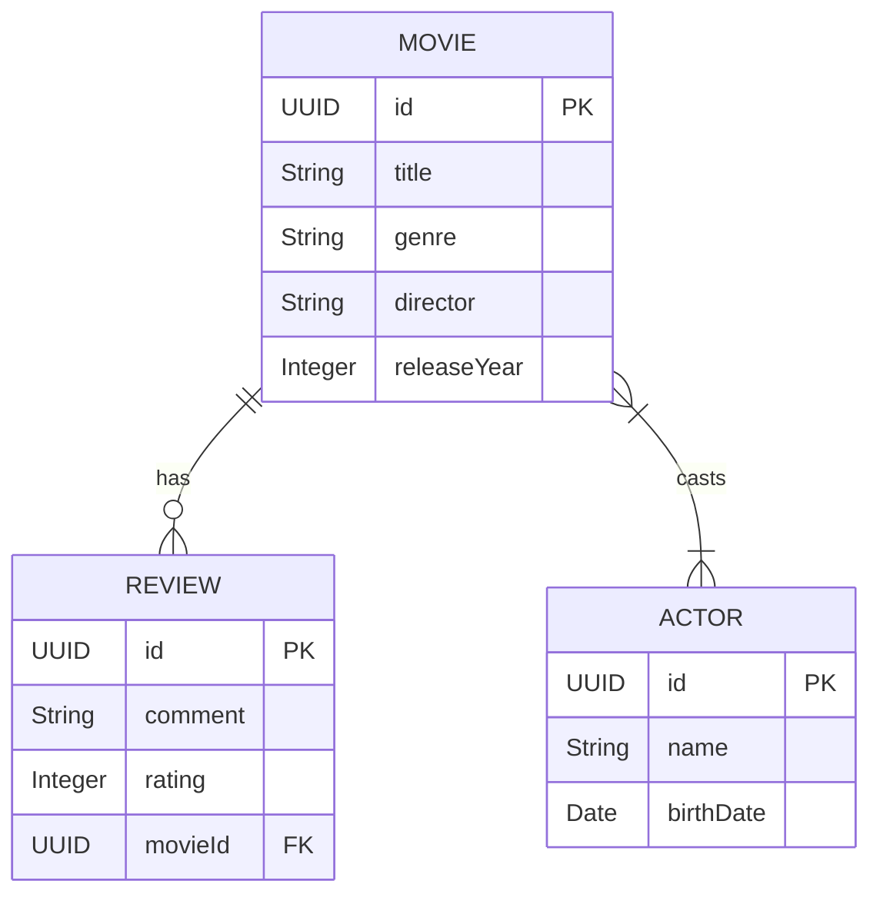

# Modelo de Dados - PoC REST vs GraphQL

## Diagrama Entidade-Relacionamento (ERD)

O modelo é intencionalmente desenhado com relacionamentos `1:N` e `N:N` para permitir simulações de carga de dados aninhados.

## Dicionário de Dados

### 1. Movie (Filme)
Entidade principal do catálogo.
- **Relacionamentos**:
  - Possui muitos **Atores** (`@ManyToMany`).
  - Possui muitos **Reviews** (`@OneToMany`).

### 2. Actor (Ator)
Ator que participa de filmes.
- **Relacionamentos**:
  - Participa de muitos **Filmes** (`@ManyToMany` mapeado pelo lado do Filme).

### 3. Review (Avaliação)
Avaliação de um filme (para gerar volume de dados extra se necessário).
- **Relacionamentos**:
  - Pertence a um **Filme** (`@ManyToOne`).

## Estratégia de Hibernate (N+1)
Para fins didáticos, a configuração de *Fetch Type* será `LAZY` nas coleções.
Isso garantirá que, se o endpoint REST não fizer o join explícito (via `@EntityGraph` ou query customizada) e tentar serializar a lista de atores durante o loop de filmes, o Hibernate disparará um select para cada filme, gerando o efeito N+1 que queremos demonstrar.
